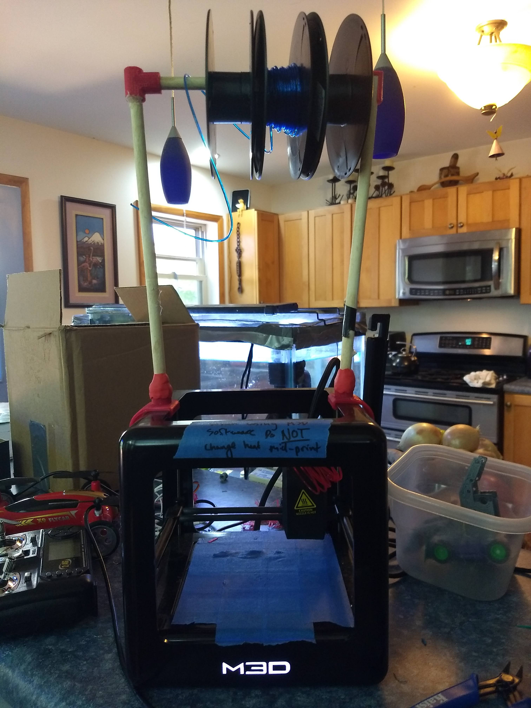
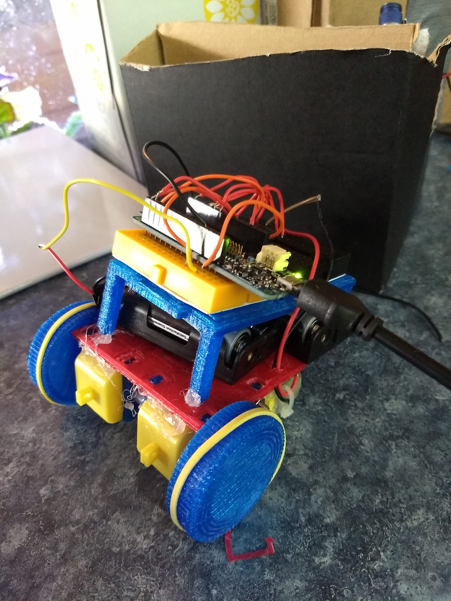

# 3D-Printed-Car

A small robotic car using 3D printed parts.

## Intro

This project is a robotic car that can be 3D printed on the Micro 3D Printer from M3D. This car was printed with M3D's tough and ABS-R filement. The software runs on an Arduino MKR1000. The car is controlled through the blynk app over wifi. The Blynk app communicates over WiFi with the MKR1000.

## Parts List
   *jhsgfds

## 3D Printing
Here is the 3D printer with custom feeder for the filament:

For this project everthing was printed on M3D's Micro printer. I used M3D's Tough and ABS-R filement for all of the prints. While the filement is fantastic I can not recomend the Micro 3D printer. All of the CAD files include a tolerance of about .2 inches. All of the CAD drawings were done in Fusion 360. I print onto painters tape. The printers setting that I use can be found here:

https://onedrive.live.com/view.aspx?cid=bba9db95c889ce42&page=view&resid=BBA9DB95C889CE42!1509&parId=BBA9DB95C889CE42!104&authkey=!AlJb8YXmwCSRwF0&app=Excel

Here is the robot car as of Aug. 30, 2020:

## Electronics
The wiring of this project is extremly simple. The motors are run through an h-bridge motor driver (L293d) by the Arduino Mkr 1000.
Below is a schematic for the wiring of this project. For the 6v power supply I used 4 AA batteries.

## Code
The code for this robot is similarly simple. It takes the input from the blynk app's joystick and converts that to power and direction for both motors. It takes input from a botton in the Blynk app as well to determine if the robot will spin in place when turning or make longer turns.
